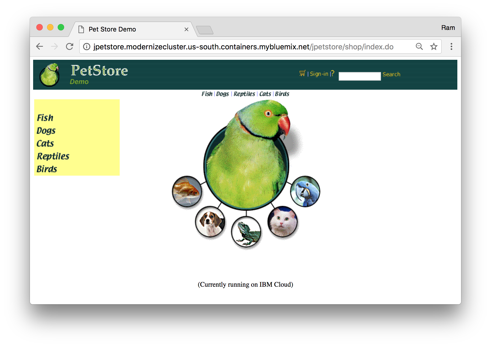
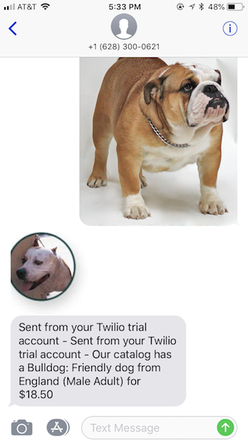

# Modernize and Extend: JPetStore on IBM Cloud Kubernetes Service

This demo modernizes an existing Java web application (JPetStore) by:

1. building Docker containers from the legacy stack
2. moving the app to Azure Kubernetes Service
3. and extending it with [Watson Visual Recognition](https://www.ibm.com/watson/services/visual-recognition/) and [Twilio](https://www.twilio.com/) text messaging (or a web chat interface).


[](https://youtu.be/26RjSa0UZp0 "Containerized Applications with IBM Cloud Kubernetes")

## Before you begin

Follow the below steps to create IBM Cloud services and resources used in this demo. You will create a Kubernetes cluster, an instance of Watson Visual Recognition and an optional [Twilio](https://www.twilio.com/) account (if you want to shop for pets using text messaging).

1. Create azure database for mysql servers and note down username, servername and password.[](https://docs.microsoft.com/en-us/azure/mysql/quickstart-create-mysql-server-database-using-azure-portal)
2. Create kubernetes service from MCMP Store or from azure portal[](https://docs.microsoft.com/en-us/azure/aks/kubernetes-walkthrough).
3. Follow the instructions in the **Access** tab of your cluster to gain access to your cluster using [**kubectl**](https://kubernetes.io/docs/reference/kubectl/overview/).

4. Visit [IBM Cloud catalog](https://cloud.ibm.com/catalog/) and [create a **Watson Visual Recognition**](https://cloud.ibm.com/catalog/services/visual-recognition) service (choose the Lite plan). After creation, you will get a set of auto-generated service credentials. The **apikey** and **URL** are required later.

5. **Optionally** visit [Twilio](http://twilio.com), sign up for a free account and **buy a number** with MMS capabilities by creating a project/feature on the Dashboard. Locate the **Account SID** and **Auth Token** from the API Credentials in the [dashboard](https://www.twilio.com/console/sms/dashboard#). Locate you **Phone Number** on the respective [Twilio page](https://www.twilio.com/console/phone-numbers/incoming).

## Manual deployment

To manually deploy the demo, follow the below steps.

### Clone the demo to your laptop

Clone the demo repository:

```bash
git clone https://github.ibm.com/mcmp-demo/jpetstore-kubernetes.git
cd jpetstore-kubernetes
```

#### Code structure

| Folder | Description |
| ---- | ----------- |
|[**jpetstore**](/jpetstore)| Traditional Java JPetStore application |
|[**mmssearch**](/mmssearch)| New Golang microservice (which uses Watson to identify the content of an image) |
|[**helm**](/helm)| Helm charts for templated Kubernetes deployments |
|[**pet-images**](/pet-images)| Pet images (which can be used for the demo) |

### Set up Watson Visual Recognition

1. Create a file with the name **mms-secrets.json** by using the existing template:

   ```bash
   # from jpetstore-kubernetes directory
   cd mmssearch
   cp mms-secrets.json.template mms-secrets.json
   ```

2. Open **mms-secrets.json** file and update the **Ingress Subdomain** in the **jpetstoreurl** field. This allows the mmssearch microservice to find the images that are part of the message back to the user.
   Example: `http://jpetstore.yourclustername.us-south.containers.appdomain.cloud `

3. Go to the [IBM Cloud catalog](https://cloud.ibm.com/catalog/) and [create a **Watson Visual Recognition**](https://cloud.ibm.com/catalog/services/visual-recognition) service (choose the Lite plan).

4. After creation, you will get a set of auto-generated service credentials. Carefully copy the **API key** and **URL** into the **watson** section of **mms-secrets.json** file.


### Set up Twilio (optional)

This step is only required if you want to use MMS text messaging during the demo (which is not possible in many countries outside the U.S.).

Skip this section if you only want to interact using the web chat.

1. Visit [Twilio](http://twilio.com), sign up for a free account and **buy a number** with MMS capabilities by creating a project/feature on the Dashboard.
2. Open the **mms-secrets.json** file and replace:

   1.  **sid** and **token** values with your **AccountSID** and the **AuthToken** from the Twilio Account Dashboard.
   2.  **number** with the number you just purchased in the format **+1XXXYYYZZZZ**.

3. Configure Twilio to send messages to the MMSSearch service
   1. Go to **Manage Numbers** on Twilio dashboard by clicking on **All Products & Services** on the left pane then click on your number.
   2. In the **Messaging** section of the **Configure** page under **A message comes in**, select **Webhook**, set the URL to `http://mmssearch.<Ingress Subdomain>/sms/receive` and the METHOD to **HTTP POST**


### Create Kubernetes secrets

Next, use the `kubectl` command to allow your Kubernetes cluster access to the secrets you just created. This will allow it to access the visual recognition and Twilio services(Optional Part):

```bash
# from the jpetstore-kubernetes directory
cd mmssearch
kubectl create secret generic mms-secret --from-file=mms-secrets=./mms-secrets.json
```
Encode mysql server secrets using base64, put the same in secrets.yaml file and run the following command.

```bash
   cd jpetstore
   kubectl apply -f secrets.yaml
```

## Build and push the container images

The docker images for each of the micro-services need to be built and then pushed to a container registry. Here are the steps for pushing to your IBM Cloud private registry, but be aware that you could also push them to a public registry.

1. Add secrets related to repository into values.yaml

2. Build and push **jpetstoredb** image. Run these commands as they are.

   ```bash
   # from the jpetstore-kubernetes directory
   cd db
   docker build . -t ${MYREGISTRY}/${MYNAMESPACE}/jpetstoredb
   docker push ${MYREGISTRY}/${MYNAMESPACE}/jpetstoredb
   ```

3. Build and push the **jpetstoreweb** image. Run these commands as they are. You do not need to replace any of the values belwo:

   ```bash
   # from the jpetstore-kubernetes directory
   cd jpetstore
   docker build . -t ${MYREGISTRY}/${MYNAMESPACE}/jpetstoreweb
   docker push ${MYREGISTRY}/${MYNAMESPACE}/jpetstoreweb
   ```

4. Build and push the **mmssearch** image(Optional Part):

   ```bash
   # from the db directory
   cd ../../mmssearch
   docker build . -t ${MYREGISTRY}/${MYNAMESPACE}/mmssearch
   docker push ${MYREGISTRY}/${MYNAMESPACE}/mmssearch
   ```

5. Finally make sure that all three images have been successfully pushed to the container registry.

## Deploy the application

There are two different ways to deploy the three micro-services to a Kubernetes cluster:

- Using [Helm](https://helm.sh/) to provide values for templated charts (recommended)
- Or, updating yaml files with the right values and then running  `kubectl create`

### Option 1: Deploy using YAML files

For this option, you need to update the YAML files to point to your registry namespace.

1. `kubectl apply -f mysqlJob.yaml`   - This creates predefined schema into mysql database.
2. `kubectl create -f jpetstore.yaml`  - This creates the JPetstore app microservices
3. `kubectl create -f jpetstore-watson.yaml`  - This creates the MMSSearch microservice(optional)


Copy the external ip under jpetstore service and try to open it in browser.
## You're Done!

You are now ready to use the UI to shop for a pet or query the store by sending it a picture of what you're looking at:

1. Access the java jpetstore application web UI for JPetstore using IP provided by `kubectl get svc -n <namespace>`

   

2. Access the mmssearch app and start uploading images from `pet-images` directory.

   

3. If you configured Twilio, send a picture of a pet to your Twilio number via your phone. The app should respond with an available pet from the store or or with a message that this type of pet is not available:


   

## Using your Mac to send text messages to Twilio

If you'd like to send and receive texts from the pet store on your Mac, do the following steps:

1. Ensure your iPhone is capable of forwarding text messages to your Mac.
    - See this [Apple support document](https://support.apple.com/en-us/HT208386).
    - If the Text Message Forwarding option is not present, confirm that your Apple ID is enabled under **Send & Receive**.
2. Access the [Getting Started page](https://www.twilio.com/console/sms/getting-started/build) from your Twilio account home page
3. In the **Send a Message** widget, enter the Twilio number you bought into the **To:** text field.
4. Add a message to the **Body** text field and click the **Make Request** button.
5. After receiving the message on your Mac, drag and drop an image into the iMessage window

## Clean up:

```bash
# Use "helm delete" to delete the two apps
kubectl delete -f jpetstore.yaml
kubectl delete -f jpetstore-watson.yaml

# Delete the secrets stored in our cluster
kubectl delete secret mms-secret

```
